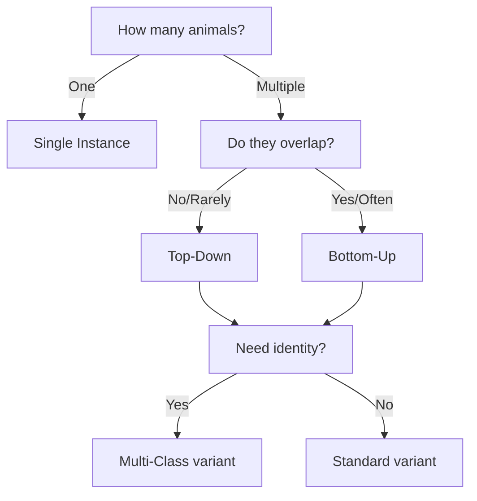

# Model Types

Understand the different model architectures in SLEAP-NN.

---

## Overview

| Model Type | Animals | Occlusion | Training | Use Case |
|------------|---------|-----------|----------|----------|
| Single Instance | 1 | N/A | 1 model | Isolated animals |
| Top-Down | Many | Some | 2 models | Multiple non-overlapping and animal sizes are smaller compared to the whole image |
| Bottom-Up | Many | Heavy | 1 model | Crowded scenes |
| Multi-Class | Many | Varies | 1-2 models | Known identities |

---

## Single Instance

**One animal per frame.**

```
Image → Backbone → Confidence Maps → Peaks
```

### When to Use

- Single animal videos
- No need for tracking
- Fastest training and inference

### Configuration

```yaml
head_configs:
  single_instance:
    confmaps:
      sigma: 5.0
      output_stride: 2
```

### Inference

```bash
sleap-nn track -i video.mp4 -m models/single_instance/
```

---

## Top-Down {#top-down}

**Two-stage: detect centers, then estimate pose.**


```
Stage 1: Image → Backbone → Centroid Map → Instance Centers
Stage 2: Crop → Backbone → Confidence Maps → Keypoints
```

### When to Use

- Multiple animals that are clearly separated
- Animals vary in size (centroid crops normalize scale)
- Need precise localization per individual

### Centroid Model Tips

!!! tip "Sigma for centroid detection"
    Increasing `sigma` makes centroid confidence maps coarser—easier to detect animals but less precise. This is often a good trade-off for the centroid stage.

!!! tip "Use a specific anchor part"
    Choosing a specific node as the centroid (e.g., thorax) leads to more consistent results than using the bounding box center, which often falls on different parts of the animal. This matters because the centered instance model depends on consistent positioning within the crop.

!!! tip "Reduce resolution for centroid model"
    Since centroids can be detected coarsely, you can reduce input image resolution (`preprocessing.scale`) to save computation. This is especially useful early in labeling when training data is limited.

!!! tip "Crop size"
    Set **crop size** large enough to include the whole animal in the centered instance crops.

### Configuration

**Centroid model:**
```yaml
head_configs:
  centroid:
    confmaps:
      anchor_part: null  # Use bbox center
      sigma: 5.0
```

**Instance model:**
```yaml
head_configs:
  centered_instance:
    confmaps:
      anchor_part: null
      sigma: 5.0

data_config:
  preprocessing:
    crop_size: 256
```

### Training

Train two models separately:

```bash
sleap-nn train --config centroid_config.yaml
sleap-nn train --config instance_config.yaml
```

### Inference

```bash
sleap-nn track -i video.mp4 \
    -m models/centroid/ \
    -m models/centered_instance/
```

---

## Bottom-Up {#bottom-up}

**Detect all keypoints, then group into instances.**


```
Image → Backbone → [Confidence Maps + Part Affinity Fields] → Grouping → Instances
```

### When to Use

- Animals frequently occlude each other
- Many animals in frame (more efficient than top-down)
- Animals touching/interacting
- Uniform animal sizes

!!! tip "Try both approaches"
    Top-down works better for some datasets while bottom-up works better for others. To maximize accuracy, try both and compare results.

### How It Works

1. **Confidence maps**: Locate all keypoints of all animals
2. **Part Affinity Fields (PAFs)**: Encode connections between keypoints
3. **Grouping**: Hungarian matching to assemble instances

### Configuration

```yaml
head_configs:
  bottomup:
    confmaps:
      sigma: 2.5
      output_stride: 4
      loss_weight: 1.0
    pafs:
      sigma: 75.0
      output_stride: 8
      loss_weight: 1.0
```

### Inference

```bash
sleap-nn track -i video.mp4 -m models/bottomup/
```

---

## Multi-Class (Identity Models)

**Pose estimation + supervised identity prediction.**

Use when you have labeled identity/track information in training data.

### Multi-Class Bottom-Up

```yaml
head_configs:
  multi_class_bottomup:
    confmaps:
      sigma: 5.0
      loss_weight: 1.0
    class_maps:
      classes: null  # Infer from track names
      sigma: 5.0
      loss_weight: 1.0
```

### Multi-Class Top-Down

```yaml
head_configs:
  multi_class_topdown:
    confmaps:
      sigma: 5.0
      loss_weight: 1.0
    class_vectors:
      classes: null
      num_fc_layers: 1
      num_fc_units: 64
      loss_weight: 1.0
```

---

## Backbones

### UNet

- Most flexible
- Works at any resolution
- Configurable depth/width

```yaml
backbone_config:
  unet:
    filters: 32
    max_stride: 16
```

### ConvNeXt

- Modern CNN architecture
- ImageNet pretrained weights
- Good for transfer learning

```yaml
backbone_config:
  convnext:
    model_type: tiny
    pre_trained_weights: ConvNeXt_Tiny_Weights
```

### Swin Transformer

- Vision transformer
- Best for global context
- Highest memory usage

```yaml
backbone_config:
  swint:
    model_type: tiny
    pre_trained_weights: Swin_T_Weights
```

---

## Choosing a Model



### Quick Guidelines

| Scenario | Recommendation |
|----------|----------------|
| Single fly in chamber | Single Instance |
| 2-3 mice, separate areas | Top-Down |
| Social behavior, touching | Bottom-Up |
| Same individuals across sessions | Multi-Class |

---

## Performance Comparison

Approximate training times on RTX 3090 (1000 labeled frames):

| Model | Training Time | Inference Speed |
|-------|--------------|-----------------|
| Single Instance | ~30 min | ~500 FPS |
| Top-Down | ~1 hr (2 models) | ~100 FPS |
| Bottom-Up | ~1 hr | ~80 FPS |

---

## Training Options

Key hyperparameters to configure when training models.

### Batch Size

Number of examples per training step.

| Setting | Effect |
|---------|--------|
| Higher | Better generalization, requires more GPU memory |
| Lower | May overfit, useful when few varied examples |

**Tip:** Reduce batch size if you run out of GPU memory.

### Receptive Field

Controls how much context the model sees around each pixel. Determined by **max stride** and **input scaling**.

| Parameter | Description |
|-----------|-------------|
| `max_stride` | Larger stride = larger receptive field, but more parameters |
| `input_scale` | Downsampling increases receptive field relative to original size |

**Rule of thumb:** Receptive field should be approximately as large as your animal.

For **top-down** models:

- **Centroid model**: Use larger receptive field (more downsampling OK)
- **Centered instance model**: Smaller receptive field to preserve details

### Augmentation

Data augmentation helps train more robust models.

| Type | Recommended Settings |
|------|---------------------|
| **Rotation** | Side view: -15° to 15°, Top view: -180° to 180° |
| **Brightness/Contrast** | Enable if test videos have different lighting |
| **Scale** | Small variations (0.9-1.1) for size robustness |

### Online Hard Keypoint Mining (OHKM)

Enable for skeletons with many joints. Makes "hard" joints contribute more to the loss, improving accuracy on difficult keypoints.

See [Shrivastava et al., 2016](https://arxiv.org/abs/1604.03540) for details.

---

## Tips

!!! tip "Start simple"
    Try Single Instance or Top-Down first. Only use Bottom-Up if needed.

!!! tip "More data helps Bottom-Up"
    PAF learning benefits from diverse poses and interactions.

!!! tip "Anchor part for Top-Down"
    Set `anchor_part` to a reliable body part (e.g., "thorax") for better cropping.
